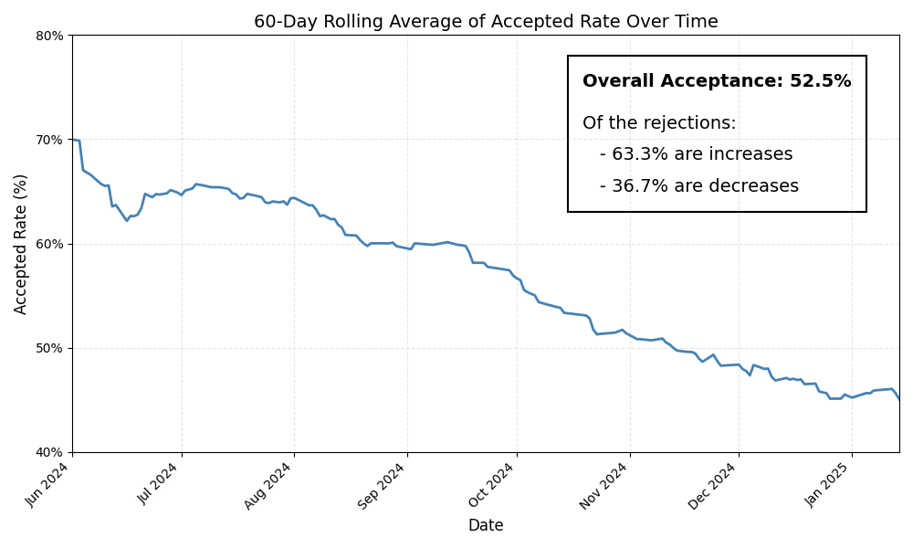
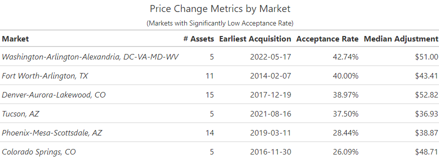
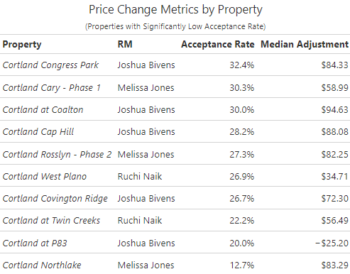

## RM Price Change Analysis

- Since May 2024, **52.3%** of RM inputted baseline rents have fallen within the range given by *RevenX*

 

||
|:--:| 
| *Rate of acceptance of RMP recommendation has steadily decreased since its inception* |

 

- Of the ~48% that do not fall within the given range:
    -  **62.3%** are above the upper bound of the range
    - **37.7%** are below the lower bound. 

 

The magnitude of the edits vary widely by market, unit group, and asset.

### Breakdown by Market

||
|:--:| 
| *These markets have significantly lower acceptance rates than average* |

||
|:--:| 
| *Adjustment trends in Denver market* |

### Breakdown by Property

||
|:--:| 
| *These properties have significantly lower acceptance rates than average* |

||
|:--:| 
| *Adjustment trends at Cortland Northlake in Ohio* |